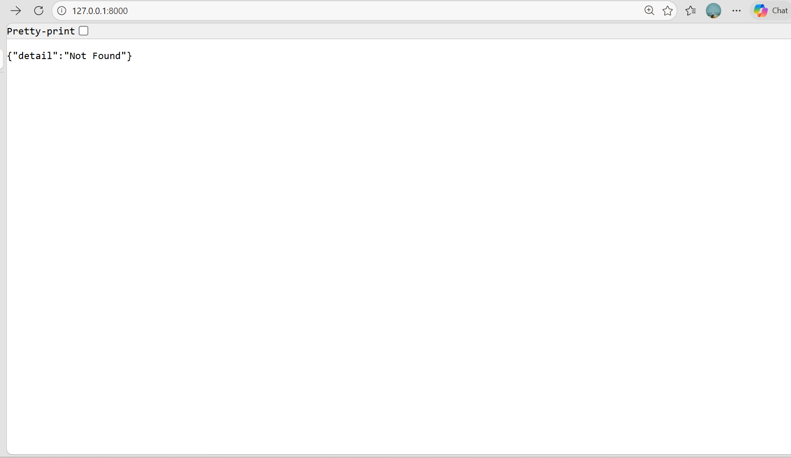
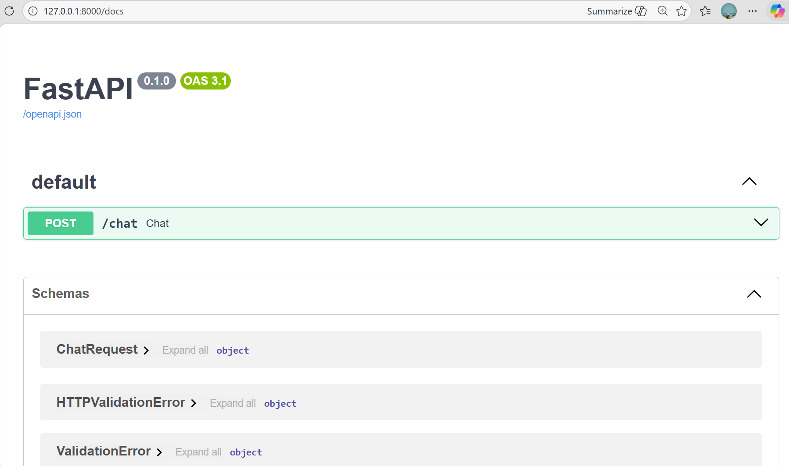
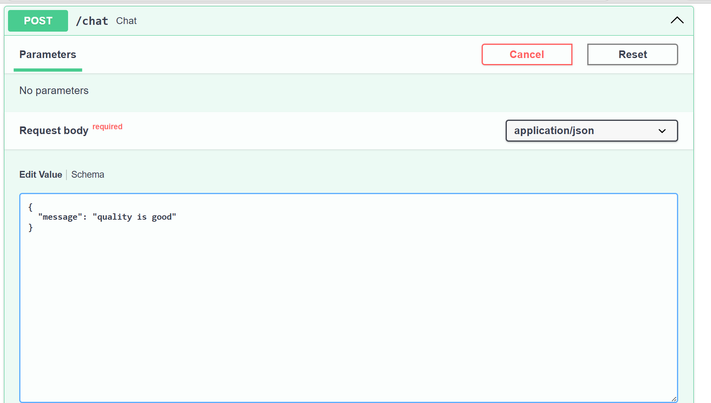
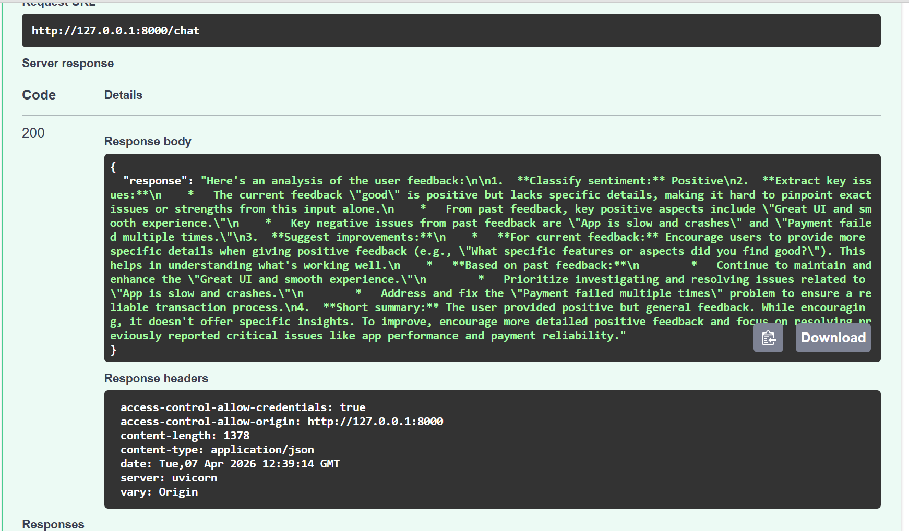

# Feedback Analyzer Backend

FastAPI backend for an AI-powered feedback analysis system using **LangChain RAG**, **FAISS**, and **Gemini 2.5 Flash**. It processes user feedback and returns structured insights like sentiment, key issues, improvements, and summary.

---

## Features

- Retrieval-Augmented Generation (RAG)
- FAISS vector database for similarity search
- Gemini 2.5 Flash LLM integration
- Prompt engineering for structured output
- FastAPI

---

## Tech Stack dependencies

- FastAPI
- LangChain
- Google Generative AI (Gemini)
- FAISS
- Python

---

## Dependencies

- **FastAPI** → A modern Python web framework to build APIs quickly and efficiently  
- **Uvicorn** → ASGI server used to run FastAPI applications  
- **LangChain** → Framework to build applications using LLMs with tools like RAG  
- **langchain-google-genai** → Integration to use Gemini models in LangChain  
- **FAISS** → Library for fast similarity search using vector embeddings  
- **python-dotenv** → Loads environment variables from `.env` file  

---

## Project Structure
```
backend/
│── app.py
│── config.py
│── rag/
│ ├── retriever.py
│ ├── embedder.py
│ ├── vector_store.py
│── prompts/
│ ├── feedback_prompt.py
│── .env
```
---

### 2. Create Virtual Environment
```
python -m venv venv
venv\Scripts\activate # Windows
```
---
### 3. Install Dependencies
```
pip install -r requirements.txt
(OR)
pip install fastapi uvicorn
pip install langchain-google-genai
pip install faiss-cpu
```
---
### 4. Add Environment Variables
```
Create `.env` file:
GOOGLE_API_KEY=your_api_key_here
```
```
How to Get Google Gemini API Key (AI Studio)
Go to: https://aistudio.google.com/app/apikey
Sign in with your Google account
Click "Create API Key"
Select a project (or create a new one)
Copy the generated API key
Paste it into your .env file:
```

**GOOGLE_API_KEY=your_actual_api_key**

```
# Important Notes
Never push your API key to GitHub
Add .env to .gitignore
Regenerate the key if exposed
```

---
### 5. Run Server
```
uvicorn app:app --reload
```

API will run at:
http://127.0.0.1:8000/
---
## API Endpoint
### POST `/chat`

#### Request
```json
{
  "message": "App is very slow"
}
```
#### Response
```json
{
  "response": "Sentiment: Positive..."
}
```

# How It Works

```
1. User sends feedback
2. Input is converted into embeddings
3. FAISS retrieves similar past feedback
4. Prompt is built using RAG
5. Gemini generates structured response
```
---
# Output
---
```
Go to -> http://127.0.0.1:8000/docs/
```



